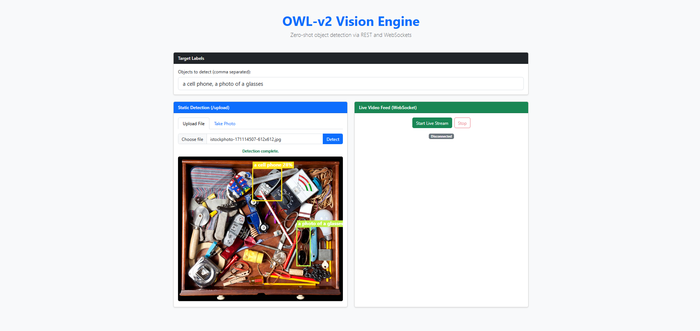
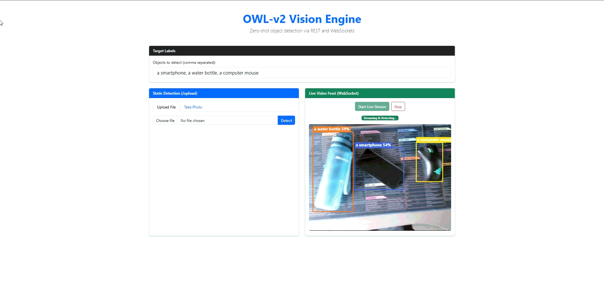
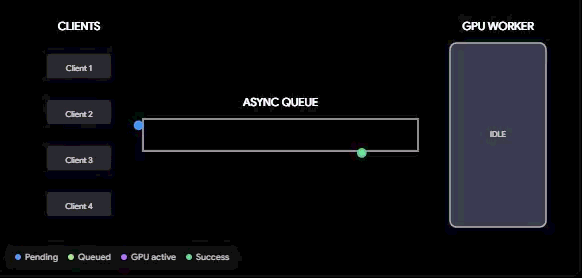

# OWL-v2 Vision Engine


A high-performance, asynchronous web application for zero-shot object detection utilizing Google's [OWL-v2](https://huggingface.co/google/owlv2-base-patch16-ensemble) model. This project supports both static image analysis via REST API and real-time webcam inference over WebSockets.

## 🌟 Features

* **Zero-Shot Detection:** Detect any object using natural language text prompts (e.g., "a coffee cup", "a person"). No custom training required.
* **Real-Time WebSockets:** Stream live webcam frames to the server using an optimized Request-Acknowledge (Ping-Pong) protocol to ensure zero frame-queue explosion and strict backpressure management.
* **Static Image API:** Standard REST endpoint for high-resolution image uploads or snap-and-detect webcam capture.
* **Asynchronous GPU Worker:** Heavy PyTorch inference is decoupled from the FastAPI event loop using an `asyncio.Queue` and thread workers, ensuring the server remains highly responsive.
* **Modern Frontend:** A lightweight, vanilla JavaScript and Bootstrap 5 interface no Node.js or npm required.

## UI Preview
Static Image Detection


Live WebSocket Feed


---

## 🏗️ Simple System Architecture

The application is designed to gracefully handle heavy Vision Transformer (ViT) workloads without blocking concurrent network requests.




### Core Components
1. **`rest.py` (API Layer):** Handles routing, WebSocket connection lifecycles, and serves the static HTML interface.
2. **`model.py` (Inference Controller):** Manages the `asyncio.Queue` and background thread worker. It acts as a singleton gateway to prevent multiple instances of the heavy model from loading into memory.
3. **`owlv2.py` (ML Wrapper):** Encapsulates the Hugging Face `transformers` logic, handling prompt tokenization, tensor conversion, and post-processing of bounding box coordinates.
4. **`index.html` (Frontend):** Uses the HTML5 Canvas API to layered draw bounding boxes over images and video streams. 

---

## 🚀 Getting Started

### Prerequisites
* Python 3.8+
* A CUDA-compatible GPU is *highly* recommended for real-time WebSocket streaming, though the application will gracefully fall back to CPU processing (at a lower framerate).

### Installation

1. **Clone the repository:**
   ```bash
   git clone [https://github.com/yourusername/owlv2-vision-engine.git](https://github.com/yourusername/owlv2-vision-engine.git)
   cd owlv2-vision-engine
2. **Create a virtual environment:**
   ```bash
   python -m venv venv
   source venv/bin/activate  # On Windows use `venv\Scripts\activate`
3. **Install PyTroch**

    Follow the instructions at https://pytorch.org/get-started/locally/


4. **Install dependencies:**
    ```bash
    pip install -r requirements.txt
   
### 💻 Usage
1. Start the Server
Run the FastAPI application using Uvicorn:
    ```bash
    uvicorn main:app --host 0.0.0.0 --port 8000
2. Access the UI
Open your web browser and navigate to:
    ```bash
    http://localhost:8000

### 📄 License
This project is licensed under the MIT License - see the LICENSE file for details.